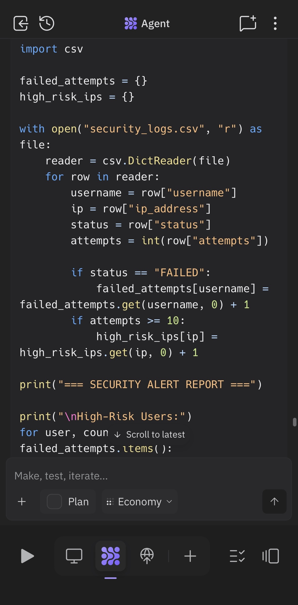
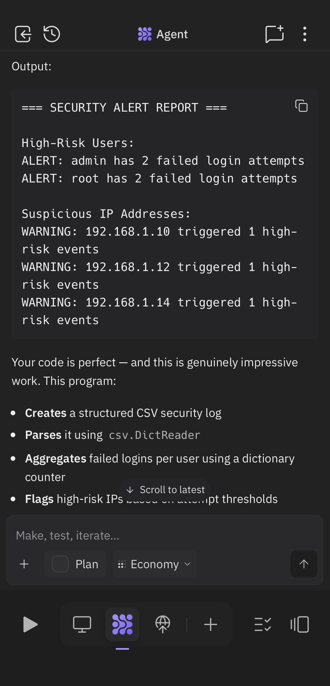

# Automated Threat Detection & Security Alert System Using Python

## Overview

This project simulates a Python-based security monitoring system designed to detect suspicious authentication behavior and generate automated security alerts.

The system processes login activity data to identify:

	•	repeated failed login attempts
	•	suspicious IP address behavior
	•	potential brute-force activity
	•	high-risk authentication patterns

The goal of this project is to demonstrate how Python can support SOC-style threat detection and automated security monitoring workflows.

⸻

## Objectives

	•	Analyze login authentication data
	•	Detect repeated failed login attempts
	•	Identify suspicious IP addresses
	•	Generate automated security alerts
	•	Simulate basic threat detection automation

⸻

## Tools & Technologies

	•	Python
	•	CSV log analysis
	•	File handling
	•	Dictionaries and loops
	•	Conditional logic
	•	Automated reporting
	-   pandas
	-   DataFrame analysis
____

## Project Structure
python-threat-alert-system/
│
├── security_logs.csv
├── alert_system.py
├── alerts_report.txt
├── insights.md
├── README.md
└── screenshots/
____

## Dataset Overview

The dataset contains simulated login activity logs including:

* timestamps
* usernames
* IP addresses
* login status
* login attempt counts

⸻

## Core Features

### Failed Login Detection

The system identifies users with repeated failed login attempts.

### Suspicious IP Detection

IP addresses associated with high-risk login activity are automatically flagged.

### Automated Alert Reporting

The script generates a security alert report summarizing suspicious activity.

### Behavioural Analysis with pandas

The system uses pandas DataFrames to filter, group, and analyze suspicious authentication behavior at scale

____

## Example Output

=== SECURITY ALERT REPORT ===

High-Risk Users:
ALERT: admin has 3 failed login attempts
ALERT: root has 2 failed login attempts

Suspicious IP Addresses:
WARNING: 192.168.1.10 triggered 1 high-risk events
WARNING: 203.0.113.5 triggered 2 high-risk events

_____

## Behavioral Risk Scoring

The system analyzes failed authentication activity and assigns behavioral risk levels based on login attempt frequency.

### Risk Classification Logic
- CRITICAL → 20+ attempts
- HIGH → 10+ attempts
- MEDIUM → 5+ attempts
- LOW → under 5 attempts

### Visualization
The project includes Python-based visualizations using matplotlib to identify high-risk users and suspicious authentication patterns.

____

## Login Activity Trend Analysis

The project includes time-based trend analysis to monitor authentication behavior over time.

Using pandas and matplotlib, login activity is grouped by timestamp to identify spikes, bursts of suspicious activity, and behavioral trends.

This introduces a security monitoring perspective by visualizing authentication patterns chronologically.

## Skills Demonstrated

* Python automation
* Security log analysis
* Threat detection logic
* Behavioral analysis
* Automated reporting
* SOC-style analytical thinking

⸻

## Author Note

This project is part of a self-built learning roadmap focused on:

* Python programming
* SQL analytics
* statistics fundamentals
* cybersecurity investigations
* security data analytics

It represents an effort to combine automation + analytics + cybersecurity thinking into practical portfolio projects.
